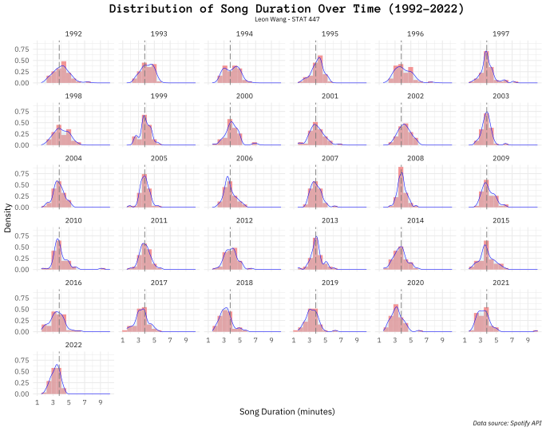

## Spotify API Project
Visualization in R using data from Spotify API

## Instructions
To replicate this visualization on your own system, all you need to do is run the `main.R` script, which will do the API calls, parsing, cleaning, and formatting to generate a pdf called `plot.pdf` into the repository. You can take a look at how all of the steps are being done by checking out the files located in the `utility` directory.
## Overview
[Video Link](https://uofi.box.com/v/stat-447-final-project)

Something I forgot to mention in this video is that `auth.sh` is probably an insecure way of generating an API token because it saves the Spotify API client secret directly into the shell file. It's encoded in Base 64 when generating the token but it's still definitely not secure. The token is likely to be generated in a more secure way when authenticating in an actual web app with a tech stack.

Because this final project needs to be able to be replicated on a Linux server like [Morrow](https://morrow.stat.illinois.edu/), I cannot access any endpoints that access user information because that requires [authentication in a browser](https://developer.spotify.com/documentation/general/guides/authorization/code-flow/), which may not be installed in servers like Morrow (I also don't have admin access to install one). I am unsure whether user authorization can work on a browser-less system, but it would certainly be difficult to do. Instead, I used the [Client Credentials flow](https://developer.spotify.com/documentation/general/guides/authorization/client-credentials/) which is system authenticated rather than by the user.
## Outline
For this project, I wanted to make my own explorations into the supposed phenomenon that songs are getting shorter in duration due to the introduction of mass streaming services around the start of the 21st century. I used the Spotify API to pull raw JSON data that was processed using R libraries `httr` and `jsonlite`. The data I pulled consisted of 30 JSON files of data per year starting from 1992 to 2022, where in each JSON file contains song data from 50 randomly selected songs from that year. I then cleaned out the data and extracted the relevant parameters including release year and song duration, and saved it into a `data.table`. Finally, I used `ggplot2` to export a plot to visualize the data in a creative way.
